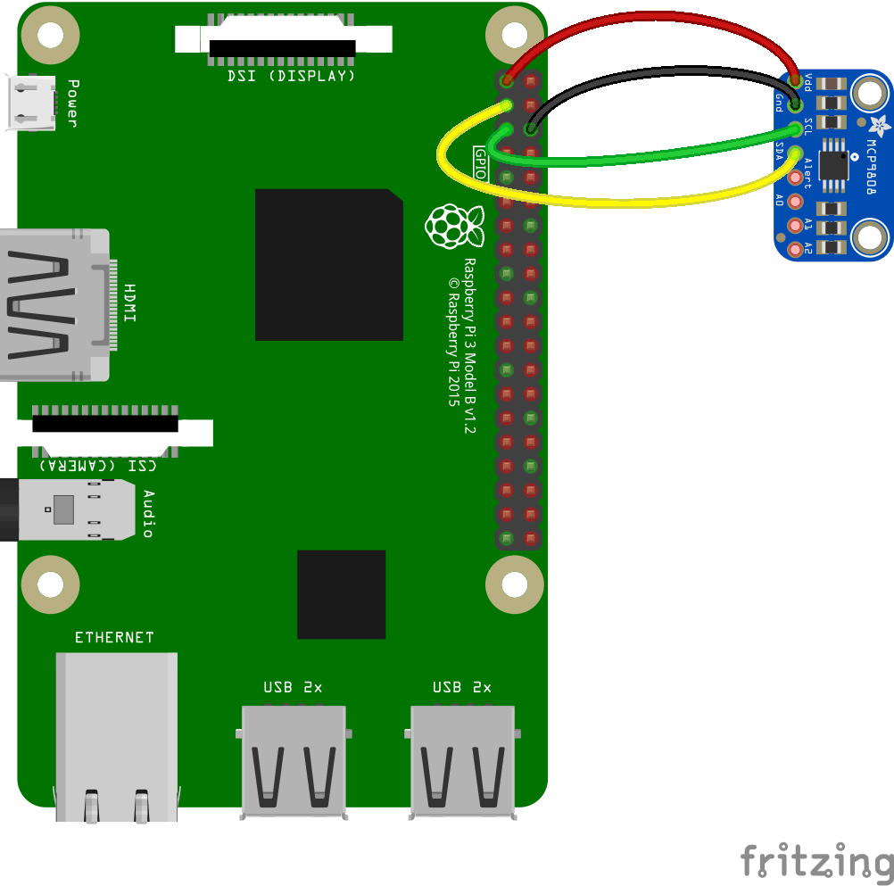

[](https://travis-ci.org/fivdi/i2c-bus)
[](https://coveralls.io/github/fivdi/i2c-bus)
[](https://www.npmjs.com/package/i2c-bus)
[](https://www.npmjs.com/package/i2c-bus)
[](https://github.com/sindresorhus/awesome-nodejs#hardware)

# i2c-bus

I2C serial bus access with **Node.js** on Linux boards like the Raspberry Pi
or BeagleBone. The i2c-bus API supports promises and async/await, asynchronous
callbacks and synchronous execution.

i2c-bus supports Node.js versions 10, 12, 14, 15 and 16.

## Contents

 * [Installation](#installation)
 * [Usage](#usage)
 * [API](#api)

## Installation

```
npm install i2c-bus
```

The way in which I2C is configured varies from board to board. Sometimes no
configuraton is required, but sometimes it is:

* [Configuring I2C on the Raspberry Pi](doc/raspberry-pi-i2c.md)
* [Configuring Software I2C on the Raspberry Pi](doc/raspberry-pi-software-i2c.md)
  * Consider software I2C when there are issues communicating with a device on a Raspberry Pi

## Usage

The example programs below show how to use a
[MCP9808 I2C temperature sensor](https://www.adafruit.com/product/1782)
to determine the temperature.

**MCP9808 I2C temperature sensor connected to a Raspberry Pi**


### Example 1 - Promises

Determine the temperature with a MCP9808 I2C temperature sensor using
promises.

```js
const i2c = require('i2c-bus');

const MCP9808_ADDR = 0x18;
const TEMP_REG = 0x05;

const toCelsius = rawData => {
  rawData = (rawData >> 8) + ((rawData & 0xff) << 8);
  let celsius = (rawData & 0x0fff) / 16;
  if (rawData & 0x1000) {
    celsius -= 256;
  }
  return celsius;
};

i2c.openPromisified(1).
then(i2c1 => i2c1.readWord(MCP9808_ADDR, TEMP_REG).
  then(rawData => console.log(toCelsius(rawData))).
  then(_ => i2c1.close())
).catch(console.log);
```

### Example 2 - Promises, Plain I2C and Buffers

Determine the temperature with a MCP9808 I2C temperature sensor using
promises, plain I2C and Buffer objects.

```js
const i2c = require('i2c-bus');

const MCP9808_ADDR = 0x18;
const TEMP_REG = 0x05;

const toCelsius = rawData => {
  let celsius = (rawData & 0x0fff) / 16;
  if (rawData & 0x1000) {
    celsius -= 256;
  }
  return celsius;
};

const wbuf = Buffer.from([TEMP_REG]);
const rbuf = Buffer.alloc(2);

i2c.openPromisified(1).
then(i2c1 => i2c1.i2cWrite(MCP9808_ADDR, wbuf.length, wbuf).
  then(_ => i2c1.i2cRead(MCP9808_ADDR, rbuf.length, rbuf)).
  then(data => console.log(toCelsius(data.buffer.readUInt16BE()))).
  then(_ => i2c1.close())
).catch(console.log);
```

### Example 3 - Asynchronous Callbacks

Determine the temperature with a MCP9808 I2C temperature sensor using
asynchronous callbacks.

```js
const i2c = require('i2c-bus');

const MCP9808_ADDR = 0x18;
const TEMP_REG = 0x05;

const toCelsius = rawData => {
  rawData = (rawData >> 8) + ((rawData & 0xff) << 8);
  let celsius = (rawData & 0x0fff) / 16;
  if (rawData & 0x1000) {
    celsius -= 256;
  }
  return celsius;
};

const i2c1 = i2c.open(1, err => {
  if (err) throw err;

  i2c1.readWord(MCP9808_ADDR, TEMP_REG, (err, rawData) => {
    if (err) throw err;

    console.log(toCelsius(rawData));

    i2c1.close(err => {
      if (err) throw err;
    });
  });
});
```

### Example 4 - Synchronous Methods

Determine the temperature with a MCP9808 I2C temperature sensor using
synchronous methods.

```js
const i2c = require('i2c-bus');

const MCP9808_ADDR = 0x18;
const TEMP_REG = 0x05;

const toCelsius = rawData => {
  rawData = (rawData >> 8) + ((rawData & 0xff) << 8);
  let celsius = (rawData & 0x0fff) / 16;
  if (rawData & 0x1000) {
    celsius -= 256;
  }
  return celsius;
};

const i2c1 = i2c.openSync(1);
const rawData = i2c1.readWordSync(MCP9808_ADDR, TEMP_REG);
console.log(toCelsius(rawData));
i2c1.closeSync();
```

## API

 * [Functions](#functions)
 * [Class Bus](#class-bus)
 * [Class PromisifiedBus](#class-promisifiedbus)
 * [Class I2cFuncs](#class-i2cfuncs)

### Functions

- [open(busNumber [, options], cb)](#openbusnumber--options-cb)
- [openSync(busNumber [, options])](#opensyncbusnumber--options)
- [openPromisified(busNumber [, options])](#openpromisifiedbusnumber--options)

### Class Bus

All methods in class Bus have asynchronous callback and synchronous forms. For
promise support see [class PromisifiedBus](#class-promisifiedbus).

The asynchronous callback form always take a completion callback as its last
argument. The arguments passed to the completion callback depend on the
method, but the first argument is always reserved for an exception. If the
operation was completed successfully, then the first argument will be null or
undefined.

When using the synchronous form any exceptions are immediately thrown. You can
use try/catch to handle exceptions or allow them to bubble up.

- Free resources
  - [bus.close(cb)](#busclosecb)
  - [bus.closeSync()](#busclosesync)

- Information
  - [bus.i2cFuncs(cb)](#busi2cfuncscb)
  - [bus.i2cFuncsSync()](#busi2cfuncssync)
  - [bus.scan([startAddr,] [endAddr,] cb)](#busscanstartaddr-endaddr-cb)
  - [bus.scanSync([startAddr,] [endAddr])](#busscansyncstartaddr-endaddr)
  - [bus.deviceId(addr, cb)](#busdeviceidaddr-cb)
  - [bus.deviceIdSync(addr)](#busdeviceidsyncaddr)

- Plain I2C
  - [bus.i2cRead(addr, length, buffer, cb)](#busi2creadaddr-length-buffer-cb)
  - [bus.i2cReadSync(addr, length, buffer)](#busi2creadsyncaddr-length-buffer)
  - [bus.i2cWrite(addr, length, buffer, cb)](#busi2cwriteaddr-length-buffer-cb)
  - [bus.i2cWriteSync(addr, length, buffer)](#busi2cwritesyncaddr-length-buffer)

- SMBus
  - [bus.readByte(addr, cmd, cb)](#busreadbyteaddr-cmd-cb)
  - [bus.readByteSync(addr, cmd)](#busreadbytesyncaddr-cmd)
  - [bus.readWord(addr, cmd, cb)](#busreadwordaddr-cmd-cb)
  - [bus.readWordSync(addr, cmd)](#busreadwordsyncaddr-cmd)
  - [bus.readI2cBlock(addr, cmd, length, buffer, cb)](#busreadi2cblockaddr-cmd-length-buffer-cb)
  - [bus.readI2cBlockSync(addr, cmd, length, buffer)](#busreadi2cblocksyncaddr-cmd-length-buffer)
  - [bus.receiveByte(addr, cb)](#busreceivebyteaddr-cb)
  - [bus.receiveByteSync(addr)](#busreceivebytesyncaddr)
  - [bus.sendByte(addr, byte, cb)](#bussendbyteaddr-byte-cb)
  - [bus.sendByteSync(addr, byte)](#bussendbytesyncaddr-byte)
  - [bus.writeByte(addr, cmd, byte, cb)](#buswritebyteaddr-cmd-byte-cb)
  - [bus.writeByteSync(addr, cmd, byte)](#buswritebytesyncaddr-cmd-byte)
  - [bus.writeWord(addr, cmd, word, cb)](#buswritewordaddr-cmd-word-cb)
  - [bus.writeWordSync(addr, cmd, word)](#buswritewordsyncaddr-cmd-word)
  - [bus.writeQuick(addr, bit, cb)](#buswritequickaddr-bit-cb)
  - [bus.writeQuickSync(addr, bit)](#buswritequicksyncaddr-bit)
  - [bus.writeI2cBlock(addr, cmd, length, buffer, cb)](#buswritei2cblockaddr-cmd-length-buffer-cb)
  - [bus.writeI2cBlockSync(addr, cmd, length, buffer)](#buswritei2cblocksyncaddr-cmd-length-buffer)

- Promises
  - [bus.promisifiedBus()](#buspromisifiedbus)

### Class PromisifiedBus

All methods in class PromisifiedBus have the asynchronous promise form. For
asynchronous callback and synchronous forms see [class Bus](#class-bus).

- Free resources
  - [promisifiedBus.close()](#promisifiedbusclose)

- Information
  - [promisifiedBus.i2cFuncs()](#promisifiedbusi2cfuncs)
  - [promisifiedBus.scan([startAddr,] [endAddr])](#promisifiedbusscanstartaddr-endaddr)
  - [promisifiedBus.deviceId(addr)](#promisifiedbusdeviceidaddr)

- Plain I2C
  - [promisifiedBus.i2cRead(addr, length, buffer)](#promisifiedbusi2creadaddr-length-buffer)
  - [promisifiedBus.i2cWrite(addr, length, buffer)](#promisifiedbusi2cwriteaddr-length-buffer)

- SMBus
  - [promisifiedBus.readByte(addr, cmd)](#promisifiedbusreadbyteaddr-cmd)
  - [promisifiedBus.readWord(addr, cmd)](#promisifiedbusreadwordaddr-cmd)
  - [promisifiedBus.readI2cBlock(addr, cmd, length, buffer)](#promisifiedbusreadi2cblockaddr-cmd-length-buffer)
  - [promisifiedBus.receiveByte(addr)](#promisifiedbusreceivebyteaddr)
  - [promisifiedBus.sendByte(addr, byte)](#promisifiedbussendbyteaddr-byte)
  - [promisifiedBus.writeByte(addr, cmd, byte)](#promisifiedbuswritebyteaddr-cmd-byte)
  - [promisifiedBus.writeWord(addr, cmd, word)](#promisifiedbuswritewordaddr-cmd-word)
  - [promisifiedBus.writeQuick(addr, bit)](#promisifiedbuswritequickaddr-bit)
  - [promisifiedBus.writeI2cBlock(addr, cmd, length, buffer)](#promisifiedbuswritei2cblockaddr-cmd-length-buffer)

- Asynchronous callbacks and synchronous execution
  - [promisifiedBus.bus()](#promisifiedbusbus)

### Class I2cFuncs

- [funcs.i2c](#funcsi2c---boolean)
- [funcs.tenBitAddr](#funcstenbitaddr---boolean)
- [funcs.protocolMangling](#funcsprotocolmangling---boolean)
- [funcs.smbusPec](#funcssmbuspec---boolean)
- [funcs.smbusBlockProcCall](#funcssmbusblockproccall---boolean)
- [funcs.smbusQuick](#funcssmbusquick---boolean)
- [funcs.smbusReceiveByte](#funcssmbusreceivebyte---boolean)
- [funcs.smbusSendByte](#funcssmbussendbyte---boolean)
- [funcs.smbusReadByte](#funcssmbusreadbyte---boolean)
- [funcs.smbusWriteByte](#funcssmbuswritebyte---boolean)
- [funcs.smbusReadWord](#funcssmbusreadword---boolean)
- [funcs.smbusWriteWord](#funcssmbuswriteword---boolean)
- [funcs.smbusProcCall](#funcssmbusproccall---boolean)
- [funcs.smbusReadBlock](#funcssmbusreadblock---boolean)
- [funcs.smbusWriteBlock](#funcssmbuswriteblock---boolean)
- [funcs.smbusReadI2cBlock](#funcssmbusreadi2cblock---boolean)
- [funcs.smbusWriteI2cBlock](#funcssmbuswritei2cblock---boolean)

### open(busNumber [, options], cb)
- busNumber - the number of the I2C bus/adapter to open, 0 for /dev/i2c-0, 1 for /dev/i2c-1, ...
- options - an optional options object
- cb - completion callback

Asynchronous open. Returns a new Bus object. The callback gets one argument (err).

The following options are supported:
- forceAccess - A boolean value specifying whether access to devices on the
I2C bus should be allowed even if they are already in use by a kernel
driver/module. Corresponds to I2C_SLAVE_FORCE on Linux. The valid values for
forceAccess are true and false. Optional, the default value is false.

### openSync(busNumber [, options])
- busNumber - the number of the I2C bus/adapter to open, 0 for /dev/i2c-0, 1 for /dev/i2c-1, ...
- options - an optional options object

Synchronous open. Returns a new Bus object.

The following options are supported:
- forceAccess - A boolean value specifying whether access to devices on the
I2C bus should be allowed even if they are already in use by a kernel
driver/module. Corresponds to I2C_SLAVE_FORCE on Linux. The valid values for
forceAccess are true and false. Optional, the default value is false.

### openPromisified(busNumber [, options])
- busNumber - the number of the I2C bus/adapter to open, 0 for /dev/i2c-0, 1 for /dev/i2c-1, ...
- options - an optional options object

Asynchronous open. Returns a Promise that, when resolved, yields a PromisifiedBus object.

The following options are supported:
- forceAccess - A boolean value specifying whether access to devices on the
I2C bus should be allowed even if they are already in use by a kernel
driver/module. Corresponds to I2C_SLAVE_FORCE on Linux. The valid values for
forceAccess are true and false. Optional, the default value is false.

### bus.close(cb)
- cb - completion callback

Asynchronous close. Frees system resources used by this instance. The callback
gets one argument (err).

### bus.closeSync()

Synchronous close. Frees system resources used by this instance.

### bus.i2cFuncs(cb)
- cb - completion callback

Determine functionality of the bus/adapter asynchronously. The callback gets
two argument (err, funcs). funcs is a frozen
[I2cFuncs](#class-i2cfuncs)
object describing the functionality available.
See also [I2C functionality](https://www.kernel.org/doc/Documentation/i2c/functionality).

### bus.i2cFuncsSync()

Determine functionality of the bus/adapter Synchronously. Returns a frozen
[I2cFuncs](#class-i2cfuncs)
object describing the functionality available.
See also [I2C functionality](https://www.kernel.org/doc/Documentation/i2c/functionality).

### bus.scan([startAddr,] [endAddr,] cb)
- startAddr - an integer specifying the start address of the scan range, optional
- endAddr - an integer specifying the end addrerss of the scan range, optional
- cb - completion callback

bus.scan(cb) - scan for I2C devices in address range 0x03 through 0x77 <br/>
bus.scan(addr, cb) - scan for an I2C device at address addr <br/>
bus.scan(startAddr, endAddr, cb) - scan for I2C devices in address range startAddr through endAddr <br/>

Scans the I2C bus asynchronously for devices. The default address range 0x03
through 0x77 is the same as the default address range used by the `i2cdetect`
command line tool. The callback gets two arguments (err, devices). devices is
an array of numbers where each number represents the I2C address of a device
which was detected.

### bus.scanSync([startAddr,] [endAddr])
- startAddr - an integer specifying the start address of the scan range, optional
- endAddr - an integer specifying the end addrerss of the scan range, optional

bus.scan() - scan for I2C devices in address range 0x03 through 0x77 <br/>
bus.scan(addr) - scan for an I2C device at address addr <br/>
bus.scan(startAddr, endAddr) - scan for I2C devices in address range startAddr through endAddr <br/>

Scans the I2C bus synchronously for devices. The default address range 0x03
through 0x77 is the same as the default address range used by the `i2cdetect`
command line tool. Returns an array of numbers where each number represents
the I2C address of a device which was detected.

### bus.deviceId(addr, cb)
- addr - I2C device address
- cb - completion callback

Asynchronous I2C device Id.  The callback gets two arguments (err, id). id is
an object with the properties `manufacturer`, `product` and if known a human
readable `name` for the associated manufacturer. `manufacturer` and `product`
are numbers, `name` is a string.

### bus.deviceIdSync(addr)
- addr - I2C device address

Synchronous I2C device Id. Returns an object with the properties 
`manufacturer`, `product` and if known a human readable `name` for the
associated manufacturer. `manufacturer` and `product` are numbers, `name` is a
string.

### bus.i2cRead(addr, length, buffer, cb)
- addr - I2C device address
- length - an integer specifying the number of bytes to read
- buffer - the [Buffer](https://nodejs.org/dist/latest/docs/api/buffer.html)
instance that the data will be written to (must conatin at least length bytes)
- cb - completion callback

Asynchronous plain I2C read. The callback gets three argument (err, bytesRead, buffer).
bytesRead is the number of bytes read.

### bus.i2cReadSync(addr, length, buffer)
- addr - I2C device address
- length - an integer specifying the number of bytes to read
- buffer - the [Buffer](https://nodejs.org/dist/latest/docs/api/buffer.html)
instance that the data will be written to (must conatin at least length bytes)

Synchronous plain I2C read. Returns the number of bytes read.

### bus.i2cWrite(addr, length, buffer, cb)
- addr - I2C device address
- length - an integer specifying the number of bytes to write
- buffer - the [Buffer](https://nodejs.org/dist/latest/docs/api/buffer.html)
instance containing the data to write (must conatin at least length bytes)
- cb - completion callback

Asynchronous plain I2C write. The callback gets three argument (err, bytesWritten, buffer).
bytesWritten is the number of bytes written.

### bus.i2cWriteSync(addr, length, buffer)
- addr - I2C device address
- length - an integer specifying the number of bytes to write
- buffer - the [Buffer](https://nodejs.org/dist/latest/docs/api/buffer.html) instance
containing the data to write (must conatin at least length bytes)

Synchronous plain I2C write. Returns the number of bytes written.

### bus.readByte(addr, cmd, cb)
- addr - I2C device address
- cmd - command code
- cb - completion callback

Asynchronous SMBus read byte. The callback gets two arguments (err, byte).
byte is an unsigned integer in the range 0 to 255.

### bus.readByteSync(addr, cmd)
- addr - I2C device address
- cmd - command code

Synchronous SMBus read byte. Returns the byte read. byte is an unsigned
integer in the range 0 to 255.

### bus.readWord(addr, cmd, cb)
- addr - I2C device address
- cmd - command code
- cb - completion callback

Asynchronous SMBus read word. The callback gets two arguments (err, word).
word is an unsigned integer in the range 0 to 65535.

### bus.readWordSync(addr, cmd)
- addr - I2C device address
- cmd - command code

Synchronous SMBus read word. Returns the word read. word is an unsigned
integer in the range 0 to 65535.

### bus.readI2cBlock(addr, cmd, length, buffer, cb)
- addr - I2C device address
- cmd - command code
- length - an integer specifying the number of bytes to read (max 32)
- buffer - the [Buffer](https://nodejs.org/dist/latest/docs/api/buffer.html)
instance that the data will be written to (must conatin at least length bytes)
- cb - completion callback

Asynchronous I2C block read (not defined by the SMBus specification). Reads a
block of bytes from a device, from a designated register that is specified by
cmd. The callback gets three arguments (err, bytesRead, buffer). bytesRead is
the number of bytes read.

### bus.readI2cBlockSync(addr, cmd, length, buffer)
- addr - I2C device address
- cmd - command code
- length - an integer specifying the number of bytes to read (max 32)
- buffer - the [Buffer](https://nodejs.org/dist/latest/docs/api/buffer.html)
instance that the data will be written to (must conatin at least length bytes)

Synchronous I2C block read (not defined by the SMBus specification). Reads a
block of bytes from a device, from a designated register that is specified by
cmd. Returns the number of bytes read.

### bus.receiveByte(addr, cb)
- addr - I2C device address
- cb - completion callback

Asynchronous SMBus receive byte. The callback gets two arguments (err, byte).
byte is an unsigned integer in the range 0 to 255.

### bus.receiveByteSync(addr)
- addr - I2C device address

Synchronous SMBus receive byte. Returns the byte received. byte is an unsigned
integer in the range 0 to 255.

### bus.sendByte(addr, byte, cb)
- addr - I2C device address
- byte - data byte. byte is an unsigned integer in the range 0 to 255.
- cb - completion callback

Asynchronous SMBus send byte. The callback gets one argument (err).

### bus.sendByteSync(addr, byte)
- addr - I2C device address
- byte - data byte. byte is an unsigned integer in the range 0 to 255.

Synchronous SMBus send byte.

### bus.writeByte(addr, cmd, byte, cb)
- addr - I2C device address
- cmd - command code
- byte - data byte. byte is an unsigned integer in the range 0 to 255.
- cb - completion callback

Asynchronous SMBus write byte. The callback gets one argument (err).

### bus.writeByteSync(addr, cmd, byte)
- addr - I2C device address
- cmd - command code
- byte - data byte. byte is an unsigned integer in the range 0 to 255.

Synchronous SMBus write byte.

### bus.writeWord(addr, cmd, word, cb)
- addr - I2C device address
- cmd - command code
- word - data word. word is an unsigned integer in the range 0 to 65535.
- cb - completion callback

Asynchronous SMBus write word. The callback gets one argument (err).

### bus.writeWordSync(addr, cmd, word)
- addr - I2C device address
- cmd - command code
- word - data word. word is an unsigned integer in the range 0 to 65535.

Synchronous SMBus write word.

### bus.writeQuick(addr, bit, cb)
- addr - I2C device address
- bit - bit to write (0 or 1)
- cb - completion callback

Asynchronous SMBus quick command. Writes a single bit to the device.
The callback gets one argument (err).

### bus.writeQuickSync(addr, bit)
- addr - I2C device address
- bit - bit to write (0 or 1)

Synchronous SMBus quick command. Writes a single bit to the device.

### bus.writeI2cBlock(addr, cmd, length, buffer, cb)
- addr - I2C device address
- cmd - command code
- length - an integer specifying the number of bytes to write (max 32)
- buffer - the [Buffer](https://nodejs.org/dist/latest/docs/api/buffer.html)
instance containing the data to write (must conatin at least length bytes)
- cb - completion callback

Asynchronous I2C block write (not defined by the SMBus specification). Writes a
block of bytes to a device, to a designated register that is specified by cmd.
The callback gets three argument (err, bytesWritten, buffer). bytesWritten is
the number of bytes written.

### bus.writeI2cBlockSync(addr, cmd, length, buffer)
- addr - I2C device address
- cmd - command code
- length - an integer specifying the number of bytes to write (max 32)
- buffer - the [Buffer](https://nodejs.org/dist/latest/docs/api/buffer.html)
instance containing the data to write (must conatin at least length bytes)

Synchronous I2C block write (not defined by the SMBus specification). Writes a
block of bytes to a device, to a designated register that is specified by cmd.

### bus.promisifiedBus()
Return the PromisifiedBus instance for this Bus instance.

### promisifiedBus.close()

Asynchronous close. Returns a Promise that will be resolved with no arguments
once the underlying resources have been released, or will be rejected if an
error occurs while closing.

### promisifiedBus.i2cFuncs()

Determine functionality of the bus/adapter asynchronously. Returns a Promise
that on success will be resolved with a frozen [I2cFuncs](#class-i2cfuncs)
object describing the functionality available. The returned Promise will be
rejected if an error occurs.
See also [I2C functionality](https://www.kernel.org/doc/Documentation/i2c/functionality).

### promisifiedBus.scan([startAddr,] [endAddr])
- startAddr - an integer specifying the start address of the scan range, optional
- endAddr - an integer specifying the end addrerss of the scan range, optional

bus.scan() - scan for I2C devices in address range 0x03 through 0x77 <br/>
bus.scan(addr) - scan for an I2C device at address addr <br/>
bus.scan(startAddr, endAddr) - scan for I2C devices in address range startAddr through endAddr <br/>

Scans the I2C bus asynchronously for devices. The default address range 0x03
through 0x77 is the same as the default address range used by the `i2cdetect`
command line tool. Returns a Promise that on success will be resolved with an
array of numbers where each number represents the I2C address of a device
which was detected. The returned Promise will be rejected if an error occurs.

### promisifiedBus.deviceId(addr)
- addr - I2C device address

Asynchronous I2C device Id. Returns a Promise that will be resolved with an id
object on success, or will be rejected if an error occurs. id is an object
with the properties `manufacturer`, `product` and if known a human readable
`name` for the associated manufacturer. `manufacturer` and `product` are
numbers, `name` is a string.

### promisifiedBus.i2cRead(addr, length, buffer)
- addr - I2C device address
- length - an integer specifying the number of bytes to read
- buffer - the [Buffer](https://nodejs.org/dist/latest/docs/api/buffer.html)
instance that the data will be written to (must conatin at least length bytes)

Asynchronous plain I2C read. Returns a Promise that on success will be
resolved with an object with a bytesRead property identifying the number of
bytes read, and a buffer property that is a reference to the passed in buffer
argument. The returned Promise will be rejected if an error occurs.

### promisifiedBus.i2cWrite(addr, length, buffer)
- addr - I2C device address
- length - an integer specifying the number of bytes to write
- buffer - the [Buffer](https://nodejs.org/dist/latest/docs/api/buffer.html)
instance containing the data to write (must conatin at least length bytes)

Asynchronous plain I2C write. Returns a Promise that on success will be
resolved with an object with a bytesWritten property identifying the number of
bytes written, and a buffer property that is a reference to the passed in
buffer argument. The returned promise will be rejected if an error occurs.

### promisifiedBus.readByte(addr, cmd)
- addr - I2C device address
- cmd - command code

Asynchronous SMBus read byte. Returns a Promise that will be resolved with a
number representing the byte read on success, or will be rejected if an error
occurs. byte is an unsigned integer in the range 0 to 255.

### promisifiedBus.readWord(addr, cmd)
- addr - I2C device address
- cmd - command code

Asynchronous SMBus read word. Returns a Promise that will be resolved with a
number representing the word read on success, or will be rejected if an error
occurs. word is an unsigned integer in the range 0 to 65535.

### promisifiedBus.readI2cBlock(addr, cmd, length, buffer)
- addr - I2C device address
- cmd - command code
- length - an integer specifying the number of bytes to read (max 32)
- buffer - the [Buffer](https://nodejs.org/dist/latest/docs/api/buffer.html)
instance that the data will be written to (must conatin at least length bytes)

Asynchronous I2C block read (not defined by the SMBus specification). Reads a
block of bytes from a device, from a designated register that is specified by
cmd. Returns a Promise that on success will be resolved with an object with a
bytesRead property identifying the number of bytes read, and a buffer property
that is a reference to the passed in buffer argument. The returned Promise
will be rejected if an error occurs.

### promisifiedBus.receiveByte(addr)
- addr - I2C device address

Asynchronous SMBus receive byte. Returns a Promise that will be resolved with
a number representing the byte received on success, or will be rejected if an
error occurs. byte is an unsigned integer in the range 0 to 255.

### promisifiedBus.sendByte(addr, byte)
- addr - I2C device address
- byte - data byte. byte is an unsigned integer in the range 0 to 255.

Asynchronous SMBus send byte. Returns a Promise that will be resolved with no
arguments on success, or will be rejected if an error occurs.

### promisifiedBus.writeByte(addr, cmd, byte)
- addr - I2C device address
- cmd - command code
- byte - data byte. byte is an unsigned integer in the range 0 to 255.

Asynchronous SMBus write byte. Returns a Promise that will be resolved with no
arguments on success, or will be rejected if an error occurs.

### promisifiedBus.writeWord(addr, cmd, word)
- addr - I2C device address
- cmd - command code
- word - data word. word is an unsigned integer in the range 0 to 65535.

Asynchronous SMBus write word. Returns a Promise that will be resolved with no
arguments on success, or will be rejected if an error occurs.

### promisifiedBus.writeQuick(addr, bit)
- addr - I2C device address
- bit - bit to write (0 or 1)

Asynchronous SMBus quick command. Writes a single bit to the device. Returns a
Promise that will be resolved with no arguments on success, or will be
rejected if an error occurs.

### promisifiedBus.writeI2cBlock(addr, cmd, length, buffer)
- addr - I2C device address
- cmd - command code
- length - an integer specifying the number of bytes to write (max 32)
- buffer - the [Buffer](https://nodejs.org/dist/latest/docs/api/buffer.html)
instance containing the data to write (must conatin at least length bytes)

Asynchronous I2C block write (not defined by the SMBus specification). Writes a
block of bytes to a device, to a designated register that is specified by cmd.
Returns a Promise that on success will be resolved with an object with a
bytesWritten property identifying the number of bytes written, and a buffer
property that is a reference to the passed in buffer argument. The returned
promise will be rejected if an error occurs.

### promisifiedBus.bus()
Return the Bus instance for this PromisifiedBus instance.

### funcs.i2c - boolean
Specifies whether or not the adapter handles plain I2C-level commands (Pure
SMBus adapters typically can not do these,
I2C_FUNC_I2C).

### funcs.tenBitAddr - boolean
Specifies whether or not the adapter handles the 10-bit address extensions
(I2C_FUNC_10BIT_ADDR).

### funcs.protocolMangling - boolean
Specifies whether or not the adapter knows about the I2C_M_IGNORE_NAK,
I2C_M_REV_DIR_ADDR and I2C_M_NO_RD_ACK flags (which modify the I2C protocol!
I2C_FUNC_PROTOCOL_MANGLING).

### funcs.smbusPec - boolean
Specifies whether or not the adapter handles packet error checking
(I2C_FUNC_SMBUS_PEC).

### funcs.smbusBlockProcCall - boolean
Specifies whether or not the adapter handles the SMBus block process call
command
(I2C_FUNC_SMBUS_BLOCK_PROC_CALL).

### funcs.smbusQuick - boolean
Specifies whether or not the adapter handles the SMBus quick command
(I2C_FUNC_SMBUS_QUICK).

### funcs.smbusReceiveByte - boolean
Specifies whether or not the adapter handles the SMBus receive byte command
(I2C_FUNC_SMBUS_READ_BYTE).

### funcs.smbusSendByte - boolean
Specifies whether or not the adapter handles the SMBus send byte command
(I2C_FUNC_SMBUS_WRITE_BYTE).

### funcs.smbusReadByte - boolean
Specifies whether or not the adapter handles the SMBus read byte command
(I2C_FUNC_SMBUS_READ_BYTE_DATA).

### funcs.smbusWriteByte - boolean
Specifies whether or not the adapter handles the SMBus write byte command
(I2C_FUNC_SMBUS_WRITE_BYTE_DATA).

### funcs.smbusReadWord - boolean
Specifies whether or not the adapter handles the SMBus read word command
(I2C_FUNC_SMBUS_READ_WORD_DATA).

### funcs.smbusWriteWord - boolean
Specifies whether or not the adapter handles the SMBus write word command
(I2C_FUNC_SMBUS_WRITE_WORD_DATA).

### funcs.smbusProcCall - boolean
Specifies whether or not the adapter handles the SMBus process call command
(I2C_FUNC_SMBUS_PROC_CALL).

### funcs.smbusReadBlock - boolean
Specifies whether or not the adapter handles the SMBus read block command
(I2C_FUNC_SMBUS_READ_BLOCK_DATA).

### funcs.smbusWriteBlock - boolean
Specifies whether or not the adapter handles the SMBus write block command
(I2C_FUNC_SMBUS_WRITE_BLOCK_DATA).

### funcs.smbusReadI2cBlock - boolean
Specifies whether or not the adapter handles the SMBus read I2C block command
(I2C_FUNC_SMBUS_READ_I2C_BLOCK).

### funcs.smbusWriteI2cBlock - boolean
Specifies whether or not the adapter handles the SMBus write i2c block command
(I2C_FUNC_SMBUS_WRITE_I2C_BLOCK).

