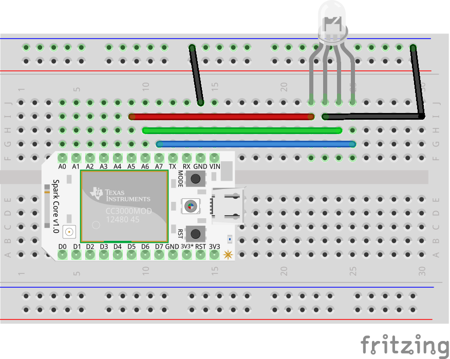

# Led Rgb

Run with:
``` bash
node eg/led-rgb.js
```


``` javascript
var five = require("johnny-five"),
  Particle = require("../lib/particle"),
  keypress = require('keypress'),
  board;


// Create Johnny-Five board connected via Particle
board = new five.Board({
  io: new Particle({
    token: process.env.PARTICLE_TOKEN,
    deviceId: process.env.PARTICLE_DEVICE_ID
  })
});

// The board's pins will not be accessible until
// the board has reported that it is ready
board.on("ready", function() {
  console.log("CONNECTED");


  // Initialize the RGB LED
  var a = new five.Led.RGB({
    pins: {
      red: "A5",
      green: "A6",
      blue: "A7"
    }
  });

  // RGB LED alternate constructor
  // This will normalize an array of pins in [r, g, b]
  // order to an object (like above) that's shaped like:
  // {
  //   red: r,
  //   green: g,
  //   blue: b
  // }
  //var a = new five.Led.RGB(["A5","A6","A7"]);

  // Turn it on and set the initial color
  a.on();
  a.color("#FF0000");

  // Listen for user input to change the RGB color
  process.stdin.resume();
  process.stdin.setEncoding('utf8');
  process.stdin.setRawMode(true);

  var keymap = {
    r: "#FF0000", // red
    g: "#00FF00", // green
    b: "#0000FF", // blue
    w: "#FFFFFF"  // white
  };

  process.stdin.on('keypress', function (ch, key) {
    
    if ( !key ) {
      return;
    }

    if (keymap[key.name]) {
      a.color(keymap[key.name]);
      a.on();
    } else {
      a.off();
    }

  });

});

board.on("error", function(error) {
  console.log(error);
});

```


## Breadboard/Illustration



[docs/breadboard/led-rgb.fzz](breadboard/led-rgb.fzz)


## Contributing
All contributions must adhere to the [Idiomatic.js Style Guide](https://github.com/rwldrn/idiomatic.js),
by maintaining the existing coding style. Add unit tests for any new or changed functionality. Lint and test your code using [grunt](https://github.com/cowboy/grunt).

## License
Copyright (c) 2012 Rick Waldron <waldron.rick@gmail.com>
Licensed under the MIT license.