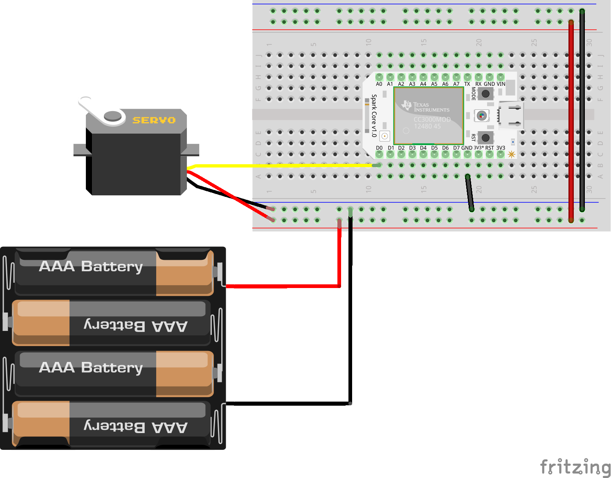

# Servo Keypress

Run with:
``` bash
node eg/servo-keypress.js
```


``` javascript
var five     = require("johnny-five");
var Particle    = require("../lib/particle");
var keypress = require('keypress');

keypress(process.stdin);

var board = new five.Board({
  io: new Particle({
    token: process.env.PARTICLE_TOKEN,
    deviceId: process.env.PARTICLE_DEVICE_ID
  })
});


board.on("ready", function() {

  console.log("Let's test a simple servo. Use Up and Down arrows for CW and CCW respectively. Space to stop.");

  var servo  = new five.Servo({
      pin  : "D0",
      type : 'continuous'
  }).stop();

  process.stdin.resume();
  process.stdin.setEncoding('utf8');
  process.stdin.setRawMode(true);

  process.stdin.on('keypress', function (ch, key) {
    
    if ( !key ) {
      return;
    }

    if ( key.name === 'q' ) {

      console.log('Quitting');
      process.exit();

    } else if ( key.name === 'up' ) {

      console.log('CW');
      servo.cw();

    } else if ( key.name === 'down' ) {

      console.log('CCW');
      servo.ccw();

    } else if ( key.name === 'space' ) {

      console.log('Stopping');
      servo.stop();

    }

  });

});
```


## Breadboard/Illustration



[docs/breadboard/servo.fzz](breadboard/servo.fzz)


## Contributing
All contributions must adhere to the [Idiomatic.js Style Guide](https://github.com/rwldrn/idiomatic.js),
by maintaining the existing coding style. Add unit tests for any new or changed functionality. Lint and test your code using [grunt](https://github.com/cowboy/grunt).

## License
Copyright (c) 2012 Rick Waldron <waldron.rick@gmail.com>
Licensed under the MIT license.